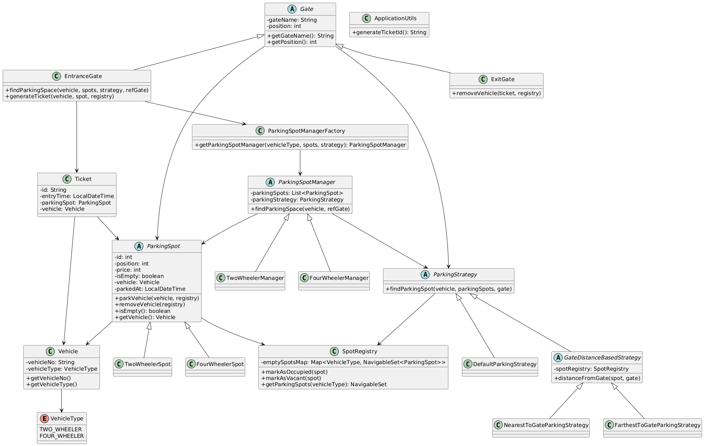

# 🚗 Parking Lot System

A scalable, extensible Java-based console simulation of a Parking Lot system. Designed using core **object-oriented principles** and **GoF design patterns**, it supports multiple entrance and exit gates, dynamic parking strategies, and live spot tracking via a central registry.

---

## 📦 Features

- ✅ **Multiple Parking Strategies**
    - `DefaultParkingStrategy`: First available spot.
    - `NearestToGateParkingStrategy`: Closest spot to a reference gate.
    - `FarthestToGateParkingStrategy`: Farthest spot from a reference gate.

- 🔄 **Flexible Reference Gate Logic**
    - Find spot nearest/farthest to any gate (entry or exit), not just the one used.

- 🛠️ **Design Patterns Used**
  | Pattern            | Used For                                      |
  |--------------------|-----------------------------------------------|
  | Strategy           | Different parking spot selection behaviors   |
  | Factory            | Creation of `ParkingSpotManager`             |
  | Registry           | Central store for live available spots       |
  | Template Method    | Common logic for gate-distance-based strategy|
  | Abstract Class     | For base models like `Gate`, `ParkingSpot`   |

- 🚪 **Multiple Entrance & Exit Gates**
    - Dynamically generated with random positions.

- 🔒 **Thread-safe SpotRegistry**
    - Keeps track of vacant spots per `VehicleType`.

---

## 📁 Project Structure

```
com.example.parkinglot
├── enums/
│   └── VehicleType.java
├── factory/
│   └── ParkingSpotManagerFactory.java
├── models/
│   ├── Vehicle.java
│   ├── Gate.java, EntranceGate.java, ExitGate.java
│   ├── ParkingSpot.java, TwoWheelerSpot.java, FourWheelerSpot.java
│   ├── ParkingSpotManager.java, TwoWheelerManager.java, FourWheelerManager.java
│   └── Ticket.java
├── registry/
│   └── SpotRegistry.java
├── strategy/
│   ├── ParkingStrategy.java
│   ├── DefaultParkingStrategy.java
│   ├── GateDistanceBasedStrategy.java
│   ├── NearestToGateParkingStrategy.java
│   └── FarthestToGateParkingStrategy.java
├── utils/
│   └── ApplicationUtils.java
├── ParkingLotMain.java
└── Main.java
```

---

## 🚦 Simulation Flow

- Initializes:
    - 300 total spots (half for 2-wheelers, half for 4-wheelers)
    - 3 random-position entrance gates
    - 3 random-position exit gates
    - 200 vehicles with randomized types
- Simulates:
    - Parking vehicles using random strategy and reference gate
    - Generates ticket
    - Random exits for half the parked vehicles
- Prints final availability status

---

## 📄 Sample Output

```
🅿️ Parked Two Wheeler with vehicle number VEH-42 at spot 23 using NearestToGateParkingStrategy via entrance Entrance 2 at position 54 (strategy reference: Exit 1 at position 77)
Ticket{id='TICKET-20250704162901-4382', vehicle=Two Wheeler - VEH-42, entryTime=2025-07-04T16:29:01.521, spot=23}
🚗 Exited vehicle VEH-42 from spot 23
```

---

## ▶️ How to Run

### ✅ Prerequisites

- Java 17+

### 🛠️ Compile & Run

```bash
javac -d out src/com/example/parkinglot/Main.java
java -cp out com.example.parkinglot.Main
```

Or if you're using an IDE like IntelliJ or Eclipse, just run `Main.java`.

---

## 🧠 Extension Ideas

- [ ] Add billing and payment calculation at exit.
- [ ] Add timestamps and receipt printing.
- [ ] Track how long each vehicle was parked.
- [ ] Introduce levels/floors and zoning.
- [ ] Introduce dynamic pricing.
- [ ] Support electric charging spots.

---

## 📚 Design Insights

This simulation aims to demonstrate:

- **Pluggability**: New strategies can be introduced without changing core logic.
- **Scalability**: Easily extendable to thousands of spots and gates.
- **Maintainability**: Clear separation of concerns via design patterns.

---

## 📊 UML Diagram



---

## 👨‍💻 Author

Designed by Aniket Kumar for showcasing **design pattern mastery** and scalable **system design** in Java.

---

```java
// Happy Parking!
```
