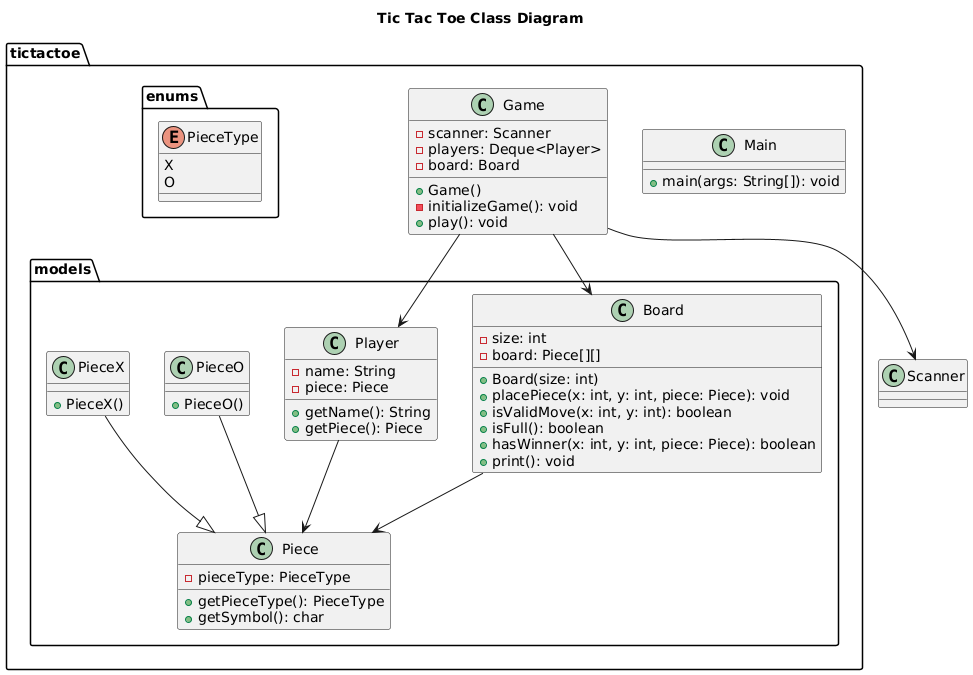

# Tic Tac Toe (Java Console Version)

A clean, modular, console-based implementation of the classic **Tic Tac Toe** game in Java, supporting dynamic board sizes and two human players.

---

## 🧠 Features

- Dynamic board size (3x3 up to 10x10)
- Two-player mode (Player X vs Player O)
- Board display after each move
- Input validation (invalid format, out-of-bound, occupied cells)
- Win and draw detection
- Clean object-oriented design

---

## 🧩 Tech Stack

- Java (Standard Edition)
- Object-Oriented Programming
- Console I/O

---

## 📁 Project Structure

```
src/
├── tictactoe/
│   ├── Game.java           # Game controller logic
│   └── Main.java           # Entry point (optional)
│
├── tictactoe/enums/
│   └── PieceType.java      # Enum for X and O
│
├── tictactoe/models/
│   ├── Board.java          # Board state & logic
│   ├── Piece.java          # Abstract piece class
│   ├── PieceX.java         # X piece
│   ├── PieceO.java         # O piece
│   └── Player.java         # Player details
```

---

## 🚀 How to Run

1. **Clone the repository or copy source files**
2. Compile all `.java` files:
   ```bash
   javac tictactoe/**/*.java
   ```
3. Run the main class:
   ```bash
   java tictactoe.Main
   ```

---

## 🎮 How to Play

- You'll be prompted to enter the board size (3–10).
- Each player will enter their name.
- On your turn, input the position as: `row,col` (e.g., `1,2`)
- Indices are **zero-based** (0 to n-1).
- First to complete a row, column, or diagonal wins!

---

## ✅ Example Game Output

```
Welcome to Tic Tac Toe Game
Please select board size (between 3 and 10): 3
Enter name for Player 1 (X): Alice
Enter name for Player 2 (O): Bob

Initial Board:
   0   1   2   
0 |   |   |   |
  -------------
1 |   |   |   |
  -------------
2 |   |   |   |
  -------------

Alice, it's your turn! Please select a position (row,col): 0,0
...
```

---

## 📌 Future Improvements (Ideas)

- Add AI opponent using Minimax
- Add GUI using JavaFX or Swing
- Save match history
- Implement undo/redo

---

## 📊 UML Diagram



---

## 👨‍💻 Author

- Built by **Aniket Kumar**

---

## 📝 License

This project is open source and free to use for educational purposes.
